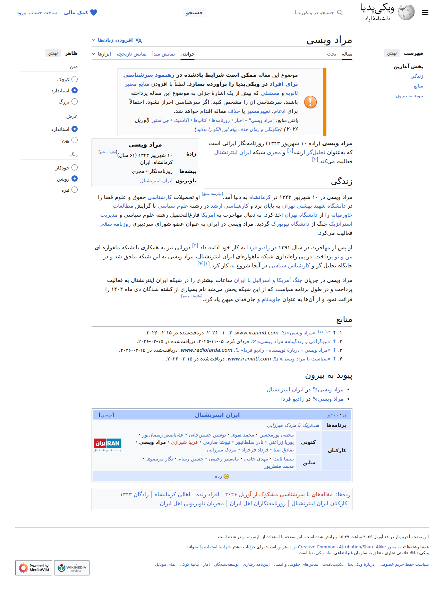

# Visited: https://fa.wikipedia.org/wiki/%D9%85%D8%B1%D8%A7%D8%AF_%D9%88%DB%8C%D8%B3%DB%8C
**Time:** Wed May  6 14:55:59 UTC 2026

## Screenshot

## Raw HTML
[page.html](./page.html)

## Downloaded Media (4 files)
## Downloaded Media Files

## Other Links
- [#](#)
- [#bodyContent](#bodyContent)
- [#cite_note-2](#cite_note-2)
- [#cite_note-3](#cite_note-3)
- [#cite_note-4](#cite_note-4)
- [#cite_note-:0-1](#cite_note-:0-1)
- [#cite_ref-2](#cite_ref-2)
- [#cite_ref-3](#cite_ref-3)
- [#cite_ref-4](#cite_ref-4)
- [#cite_ref-:0_1-0](#cite_ref-:0_1-0)
- [#cite_ref-:0_1-1](#cite_ref-:0_1-1)
- [#زندگی](#زندگی)
- [#منابع](#منابع)
- [#پیوند_به_بیرون](#پیوند_به_بیرون)
- [./رده:افراد_زنده](./رده:افراد_زنده)
- [./رده:اهالی_کرمانشاه](./رده:اهالی_کرمانشاه)
- [./رده:روزنامه‌نگاران_اهل_ایران](./رده:روزنامه‌نگاران_اهل_ایران)
- [./رده:زادگان_۱۳۴۳](./رده:زادگان_۱۳۴۳)
- [./رده:مجریان_تلویزیونی_اهل_ایران](./رده:مجریان_تلویزیونی_اهل_ایران)
- [./رده:مقاله‌ها_با_اچ‌کاردها](./رده:مقاله‌ها_با_اچ‌کاردها)
- [./رده:مقاله‌های_با_سرشناسی_مشکوک_از_آوریل_۲۰۲۶](./رده:مقاله‌های_با_سرشناسی_مشکوک_از_آوریل_۲۰۲۶)
- [./رده:مقاله‌های_دارای_پارامتر_تاریخ_نادرست_در_الگو](./رده:مقاله‌های_دارای_پارامتر_تاریخ_نادرست_در_الگو)
- [./رده:مقاله‌های_زندگی‌نامه_با_سرشناسی_مشکوک](./رده:مقاله‌های_زندگی‌نامه_با_سرشناسی_مشکوک)
- [./رده:همه_مقاله‌های_با_سرشناسی_مشکوک](./رده:همه_مقاله‌های_با_سرشناسی_مشکوک)
- [./رده:همه_مقاله‌های_دارای_عبارت‌های_بدون_منبع](./رده:همه_مقاله‌های_دارای_عبارت‌های_بدون_منبع)
- [./رده:کارکنان_ایران_اینترنشنال](./رده:کارکنان_ایران_اینترنشنال)
- [//creativecommons.org/licenses/by-sa/4.0/deed.en](//creativecommons.org/licenses/by-sa/4.0/deed.en)
- [//fa.wikipedia.org/w/api.php?action=rsd](//fa.wikipedia.org/w/api.php?action=rsd)
- [//fa.wikipedia.org/w/index.php?title=%D9%85%D8%B1%D8%A7%D8%AF_%D9%88%DB%8C%D8%B3%DB%8C&amp;mobileaction=toggle_view_mobile](//fa.wikipedia.org/w/index.php?title=%D9%85%D8%B1%D8%A7%D8%AF_%D9%88%DB%8C%D8%B3%DB%8C&amp;mobileaction=toggle_view_mobile)
- [//fa.wikipedia.org/wiki/%D9%88%DB%8C%DA%A9%DB%8C%E2%80%8C%D9%BE%D8%AF%DB%8C%D8%A7:%D8%AA%D9%85%D8%A7%D8%B3_%D8%A8%D8%A7_%D9%85%D8%A7](//fa.wikipedia.org/wiki/%D9%88%DB%8C%DA%A9%DB%8C%E2%80%8C%D9%BE%D8%AF%DB%8C%D8%A7:%D8%AA%D9%85%D8%A7%D8%B3_%D8%A8%D8%A7_%D9%85%D8%A7)
- [//fa.wikipedia.org/wiki/الگو:ایران_اینترنشنال](//fa.wikipedia.org/wiki/الگو:ایران_اینترنشنال)
- [//fa.wikipedia.org/wiki/ایالات_متحده_آمریکا](//fa.wikipedia.org/wiki/ایالات_متحده_آمریکا)
- [//fa.wikipedia.org/wiki/ایران_اینترنشنال](//fa.wikipedia.org/wiki/ایران_اینترنشنال)
- [//fa.wikipedia.org/wiki/بحث_الگو:ایران_اینترنشنال?action=edit&amp;redlink=1](//fa.wikipedia.org/wiki/بحث_الگو:ایران_اینترنشنال?action=edit&amp;redlink=1)
- [//fa.wikipedia.org/wiki/تحلیل‌گر](//fa.wikipedia.org/wiki/تحلیل‌گر)
- [//fa.wikipedia.org/wiki/تلویزیون_من‌وتو](//fa.wikipedia.org/wiki/تلویزیون_من‌وتو)
- [//fa.wikipedia.org/wiki/جاویدنام](//fa.wikipedia.org/wiki/جاویدنام)
- [//fa.wikipedia.org/wiki/جنگ_آمریکا_و_اسرائیل_با_ایران](//fa.wikipedia.org/wiki/جنگ_آمریکا_و_اسرائیل_با_ایران)
- [//fa.wikipedia.org/wiki/حسین_رسام](//fa.wikipedia.org/wiki/حسین_رسام)
- [//fa.wikipedia.org/wiki/دانشگاه_تهران](//fa.wikipedia.org/wiki/دانشگاه_تهران)
- [//fa.wikipedia.org/wiki/دانشگاه_شهید_بهشتی](//fa.wikipedia.org/wiki/دانشگاه_شهید_بهشتی)
- [//fa.wikipedia.org/wiki/دانشگاه_نیویورک](//fa.wikipedia.org/wiki/دانشگاه_نیویورک)
- [//fa.wikipedia.org/wiki/رادیو_فردا](//fa.wikipedia.org/wiki/رادیو_فردا)
- [//fa.wikipedia.org/wiki/راهنما:حذف_الگوی_نگهداری](//fa.wikipedia.org/wiki/راهنما:حذف_الگوی_نگهداری)
- [//fa.wikipedia.org/wiki/رده:ایران_اینترنشنال](//fa.wikipedia.org/wiki/رده:ایران_اینترنشنال)
- [//fa.wikipedia.org/wiki/سلام_(روزنامه)](//fa.wikipedia.org/wiki/سلام_(روزنامه))
- [//fa.wikipedia.org/wiki/سیما_ثابت](//fa.wikipedia.org/wiki/سیما_ثابت)
- [//fa.wikipedia.org/wiki/صادق_صبا](//fa.wikipedia.org/wiki/صادق_صبا)
- [//fa.wikipedia.org/wiki/علوم_سیاسی](//fa.wikipedia.org/wiki/علوم_سیاسی)
- [//fa.wikipedia.org/wiki/علی‌اصغر_رمضان‌پور](//fa.wikipedia.org/wiki/علی‌اصغر_رمضان‌پور)

## Stats
- Links: 169
- Media: 4
